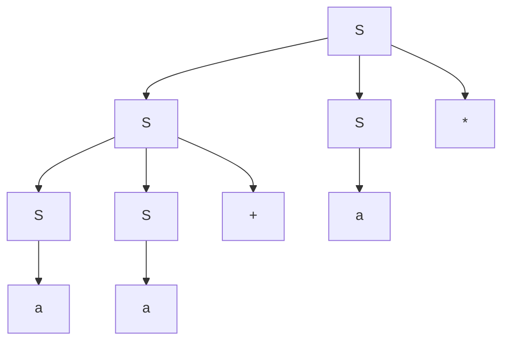

# 编译原理第四次作业

梁昱桐 2100013116

<i>Peking University</i>

## Ex 2.2.1

考虑下面的上下文无关文法：

$$
S \rightarrow SS + \mid SS \ast \mid a
$$

1. 试说明如何使用该文法生成串 \( aa + a \)。
2. 试为这个串构造一棵语法分析树。
3. 该文法生成的语言是什么？证明你的答案。

Answer:

### 第 1 问

使用最左推导:

$$
\begin{aligned}
S 
& \Rightarrow SS* \\
& \Rightarrow SS+S* \\
& \Rightarrow aS+S* \\
& \Rightarrow aa+S* \\
& \Rightarrow aa+a* \\
\end{aligned}
$$

### 第 2 问

### 第 3 问

$L(G) = a+$

充分性：$L(G) \subset L$：由于只有 $a$ 一个终止状态，且显然不接受空串

必要性：$L \subset L(G)$：只需证明可以生成 $a+$ 即可：

$$
\begin{aligned}
S 
& \Rightarrow SS* \\
& \Rightarrow aa* \\
& = a+ \\
\end{aligned}
$$

## Ex 4.2.1

考虑上下文无关文法：

$$
S \rightarrow SS + \mid SS \ast \mid a
$$

以及串 $ aa + a \ast $。

1. 给出这个串的一个最左推导。
2. 给出这个串的一个最右推导。
3. 给出这个串的一棵语法分析树。
4. 这个文法是否为二义性？证明你的回答。
5. 描述这个文法生成的语言。

Answer:

### 第 1 问

$$
S \Rightarrow_{lm} SS* \Rightarrow_{lm} SS+S* \Rightarrow_{lm} aS+S* \Rightarrow_{lm} aa+S* \Rightarrow_{lm} aa+a*
$$

### 第 2 问

$$
S \Rightarrow_{rm} SS* \Rightarrow_{rm} Sa* \Rightarrow_{rm} SS+a* \Rightarrow_{rm} Sa+a* \Rightarrow_{rm} aa+a*
$$

### 第 3 问

### 第 4 问

不是

因为如果想要 $+$ 之后出现 term, 那么必须先展开 $SS*$ 再展开 $SS+$ 此时就完全决定了这个语法分析树的结构, 从而不具有二义性.

### 第 5 问

加法和乘法的后缀表达式

充分性：$L(G) \subset L$:

归纳基础: 推导长度为 1 , 那么只可能是 a, 这是后缀表达式

归纳步骤: 假设推导长度小于等于 n 的表达式都可以表示为后缀表达式, 那么对于推导长度为 n+1 的表达式, 如果最后一步是乘法, 那么前面一定是两个后缀表达式, 后面接 *, 这也是一个后缀表达式. 如果最后一步是加法, 那么前面一定是两个后缀表达式, 后面接 +, 这也是一个后缀表达式. 因此归纳步骤成立.

必要性：$L \subset L(G)$：

归纳基础: 长度为 1 的后缀表达式只可能是 a, 这是可以被推导出来的

归纳步骤: 假设长度小于等于 $2k+1$ 的后缀表达式都可以被推导出来, 那么对于长度为 $2k+3$ 的后缀表达式, 如果最后一步是乘法, 那么前面一定是两个后缀表达式, 后面接 *, 这也是一个后缀表达式. 如果最后一步是加法, 那么前面一定是两个后缀表达式, 后面接 +, 这也是一个后缀表达式. 因此归纳步骤成立.

## Ex 4.2.3 

为下面的语言设计文法：

1) 所有由 0 和 1 组成的并且每个 0 之后都至少跟着一个 1 的串的集合。

2) 所有由 0 和 1 组成的回文（palindrome）的集合，也就是从前面和后面读结果都相同的串的集合。

3) 所有由 0 和 1 组成的具有相同多个 0 和 1 的串的集合。

4) 所有由 0 和 1 组成的并且 0 的个数和 1 的个数不同的串的集合。

5) 所有由 0 和 1 组成的且其中不包含子串 011 的串的集合。

6) 所有由 0 和 1 组成的形如 $xy$ 的串的集合，其中 $x \neq y$ 且 $x$ 和 $y$ 等长。

Answer:

### 第 1 问

$$
S\to ST|\varepsilon \\
T\to 01|1
$$

### 第 2 问

$$
S\to 1S1 | 0S0 | 0|1|\varepsilon
$$

### 第 3 问

$$
S\to 01S | 0S1 | 10S | 1S0 | S01 | S10 | \varepsilon
$$

或者
$$
S \to 0S1 | 10S | SS | \varepsilon
$$

### 第 4 问

$$
S \rightarrow A0A | A1A \\
A \rightarrow (0|1)*
$$

其中 $A0A$ 和 $A1A$ 可以保证无论 $A$ 是什么字符串, S 都不是 01 数量相等的字符串, $A$ 只要是任意字符串即可

### 第 5 问

$$
S \to 1*(0+1?)*
$$

### 第 6 问

所有由 0 和 1 组成的形如 xy 的串的集合，其中 x 不等于 y 且 x 和 y 等长。

$$
S\to X^n0X^mX^n1X^m|X^n1X^mX^n0X^m {~}{~}(n,m>0)\\
X\to 0|1
$$

这个表达式可以理解为，左右两个子串至少有一个相应位是不同的，但是他们的长度又是相同的。
