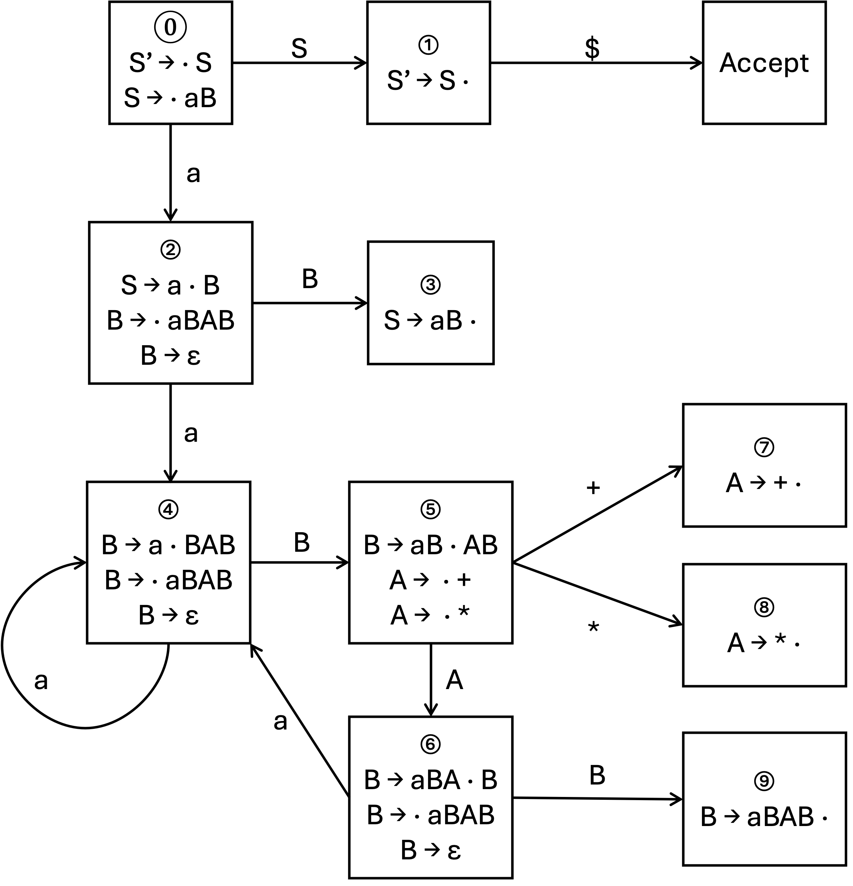

# 编译原理第六次作业

梁昱桐 2100013116

<i>Peking University</i>

## Ex 4.5.1

对于练习4.2.2（a）中的文法 S $\rightarrow$ 0S1 $\mid$ 01，指出下面各个最右句型的句柄：

1) 000111
   句柄：01
2) 00S11
   句柄：0S1

## Ex 4.5.2

对于练习4.2.1的文法 S $\rightarrow$ SS + $\mid$ SS * $\mid$ a 和下面各个最右句型，重复练习4.5.1：

1) SSS + a * +
   句柄：SS +
2) SS + a * a +
   句柄：SS +
3) aaa * a ++
   句柄：a

## Ex 4.6.2

为练习4.2.1中的（增广）文法构造 SLR 项集。计算这些项集的 GOTO 函数。给出这个文法的语法分析表。这个文法是 SLR 文法吗？

$$
S \rightarrow S S + \mid S S * \mid a
$$

Answer:

提取左公因子和消除左递归后得到：

$$
S' \rightarrow S\\
S \rightarrow a B\\
B \rightarrow a B A B\\
B \rightarrow \varepsilon\\
A \rightarrow +\\
A \rightarrow *
$$

算出所有闭包画出 DFA:

其中:

FOLLOW(S) = [\$]
FOLLOW(A) = [a, \$]
FOLLOW(B) = [+, * ,\$]

根据 FOLLOW 集构造 SLR 语法分析表如下：

<table>
    <thead>
        <tr>
            <th rowspan="2">状态</th>
            <th colspan="4">ACTION</th>
            <th colspan="3">GOTO</th>
        </tr>
        <tr>
            <th>a</th>
            <th>+</th>
            <th>*</th>
            <th>$</th>
            <th>S</th>
            <th>A</th>
            <th>B</th>
        </tr>
    </thead>
    <tbody>
        <tr>
            <td>0</td>
            <td>s2</td>
            <td></td>
            <td></td>
            <td></td>
            <td>s1</td>
            <td></td>
            <td></td>
        </tr>
        <tr>
            <td>1</td>
            <td></td>
            <td></td>
            <td></td>
            <td>acc</td>
            <td></td>
            <td></td>
            <td></td>
        </tr>
        <tr>
            <td>2</td>
            <td>s4</td>
            <td>r3</td>
            <td>r3</td>
            <td>r3</td>
            <td></td>
            <td></td>
            <td>s3</td>
        </tr>
        <tr>
            <td>3</td>
            <td></td>
            <td></td>
            <td></td>
            <td>r1</td>
            <td></td>
            <td></td>
            <td></td>
        </tr>
        <tr>
            <td>4</td>
            <td>s4</td>
            <td>r3</td>
            <td>r3</td>
            <td>r3</td>
            <td></td>
            <td></td>
            <td>s5</td>
        </tr>
        <tr>
            <td>5</td>
            <td></td>
            <td>s7</td>
            <td>s8</td>
            <td></td>
            <td></td>
            <td>s6</td>
            <td></td>
        </tr>
        <tr>
            <td>6</td>
            <td>s4</td>
            <td>r3</td>
            <td>r3</td>
            <td>r3</td>
            <td></td>
            <td></td>
            <td>s9</td>
        </tr>
        <tr>
            <td>7</td>
            <td>r4</td>
            <td></td>
            <td></td>
            <td>r4</td>
            <td></td>
            <td></td>
            <td></td>
        </tr>
        <tr>
            <td>8</td>
            <td>r5</td>
            <td></td>
            <td></td>
            <td>r5</td>
            <td></td>
            <td></td>
            <td></td>
        </tr>
        <tr>
            <td>9</td>
            <td></td>
            <td>r2</td>
            <td>r2</td>
            <td>r2</td>
            <td></td>
            <td></td>
            <td></td>
        </tr>
    </tbody>
</table>

不存在有两个动作的单元格，因此这是一个 SLR 文法

## Ex 4.6.3

利用练习4.6.2得到的语法分析表，给出处理输入 aa * a + 时的各个动作。

Answer:

<table>
    <thead>
        <tr>
            <th></th>
            <th>状态栈</th>
            <th>当前解析符号栈</th>
            <th>剩余输入</th>
            <th>动作</th>
        </tr>
    </thead>
    <tbody>
        <tr>
            <td>1)</td>
            <td>0</td>
            <td></td>
            <td>aa*a+$</td>
            <td>移入</td>
        </tr>
        <tr>
            <td>2)</td>
            <td>02</td>
            <td>a</td>
            <td>a*a+$</td>
            <td>移入</td>
        </tr>
        <tr>
            <td>3)</td>
            <td>024</td>
            <td>aa</td>
            <td>*a+$</td>
            <td>根据 B -> ε 规约</td>
        </tr>
        <tr>
            <td>4)</td>
            <td>0245</td>
            <td>aaB</td>
            <td>*a+$</td>
            <td>移入</td>
        </tr>
        <tr>
            <td>5)</td>
            <td>02458</td>
            <td>aaB*</td>
            <td>a+$</td>
            <td>根据 A -> * 规约</td>
        </tr>
        <tr>
            <td>6)</td>
            <td>02456</td>
            <td>aaBA</td>
            <td>a+$</td>
            <td>移入</td>
        </tr>
        <tr>
            <td>7)</td>
            <td>024564</td>
            <td>aaBAa</td>
            <td>+$</td>
            <td>根据 B -> ε 规约</td>
        </tr>
        <tr>
            <td>8)</td>
            <td>0245645</td>
            <td>aaBAaB</td>
            <td>+$</td>
            <td>移入</td>
        </tr>
        <tr>
            <td>9)</td>
            <td>02456457</td>
            <td>aaBAaB+</td>
            <td>$</td>
            <td>根据 A -> + 规约</td>
        </tr>
        <tr>
            <td>10)</td>
            <td>02456456</td>
            <td>aaBAaBA</td>
            <td>$</td>
            <td>根据 B -> ε 规约</td>
        </tr>
        <tr>
            <td>11)</td>
            <td>024564569</td>
            <td>aaBAaBAB</td>
            <td>$</td>
            <td>根据 B -> aBAB 规约</td>
        </tr>
        <tr>
            <td>12)</td>
            <td>024569</td>
            <td>aaBAB</td>
            <td>$</td>
            <td>根据 B -> aBAB 规约</td>
        </tr>
        <tr>
            <td>13)</td>
            <td>023</td>
            <td>aB</td>
            <td>$</td>
            <td>根据 S -> aB 规约</td>
        </tr>
        <tr>
            <td>14)</td>
            <td>01</td>
            <td>S</td>
            <td>$</td>
            <td>接受</td>
        </tr>
    </tbody>
</table>

## Ex 4.6.5

说明下面的文法是LL（1）的，但不是SLR（1）的。

$$
S \rightarrow AaAb \mid BbBa\\
A \rightarrow \varepsilon\\
B \rightarrow \varepsilon
$$

Answer:

1. 该文法是 LL(1) 的
   该文法的两个生成式 `S -> AaAb` 和 `S -> BbBa` 分别只能推导出 `ab` 和 `ba` ，因此不存在两个生成式能推导出相同的串，所以是 LL(1) 的
2. 该文法不是 SLR(1) 的
   计算可得

   $$
   Follow(A)=\{a, b\}\\
   Follow(B)=\{a, b\}
   $$

   考虑该文法的第一个闭包
   $$
   S \rightarrow \cdot AaAb\\
   S \rightarrow \cdot BbBa\\
   A \rightarrow \varepsilon\\
   B \rightarrow \varepsilon
   $$

   对应的 SLR 分析表行:
   <table>
        <thead>
            <tr>
                <th rowspan="2">状态</th>
                <th colspan="3">ACTION</th>
                <th colspan="3">GOTO</th>
            </tr>
            <tr>
                <th>a</th>
                <th>b</th>
                <th>$</th>
                <th>S</th>
                <th>A</th>
                <th>B</th>
            </tr>
        </thead>
        <tbody>
            <tr>
                <td>0</td>
                <td>r2,r3</td>
                <td>r2,r3</td>
                <td></td>
                <td></td>
                <td>s1</td>
                <td>s2</td>
            </tr>
        </tbody>
    </table>
   因为 A 和 B 的 FOLLOW 集相同，因此规约的时候不知道规约 A 还是 B，因此存在规约-规约冲突，所以不是 SLR(1) 的.
